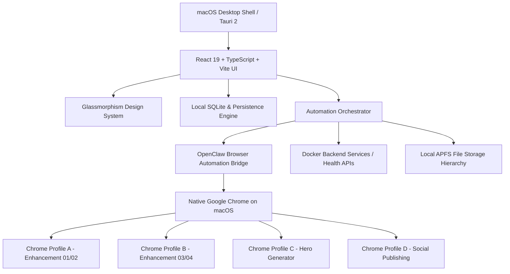

# EstateFlow Control — Architecture & Operator Guide

EstateFlow Control is a production macOS desktop automation control center for luxury real-estate portfolios, automated multi-worker image enhancement, and multi-channel publishing.

---

## 1. System Architecture



### Core Architecture Layers:
1. **Desktop Shell (Tauri 2)**:
   - Native Apple Silicon ARM64 / Intel binary.
   - Manages sandboxed windows, native menus, and filesystem links.
2. **Presentation Layer (React 19 & Tailwind CSS v4)**:
   - Zero CDN dependencies.
   - Subtle, readable Glassmorphism with curated Red (`#E11D48`), White, and Charcoal neutral palette.
   - Accessible icons from `react-icons` (zero emoji in production UI).
   - High-contrast Dark and Light theme engines with system preference tracking.
3. **Local Database & Persistence Layer**:
   - SQLite schema with versioned migrations (`schema_version: 2`).
   - Stores properties, photos, prompts, worker pools, queues, logs, and settings.
   - Includes snapshot backup and recovery without copying media files.
4. **Automation Engine & Queue**:
   - State-based event detection (Uploading -> Generating -> Result Detected -> Downloading -> Verifying -> Completed).
   - Zero hardcoded sleeps; uses DOM event detection with timeout backstops.
   - Parallel worker pool (Worker 01, Worker 02, etc.).
   - Multi-attempt auto-retry policy (3 attempts max before flagging for operator review).
5. **OpenClaw Integration**:
   - Manages CDP sessions to native macOS Chrome profiles without saving user passwords.
   - Manages manual login flows, session health telemetry, and screenshot previews.
6. **Multi-Channel Publishing**:
   - Supports Facebook Page, Facebook Marketplace, and TikTok.
   - Enforces a manual operator approval gate to prevent unauthorized publishing.

---

## 2. Local File Organization (Section 21 & 49)

All property media files are organized automatically in the user's Documents folder:

```
~/Documents/EstateFlow Control/
└── [Project Name]/
    ├── Original/       # Raw uploaded camera images
    ├── Enhanced/       # AI-enhanced architectural photos (verified)
    ├── Hero/           # 1:1 Facebook and 9:16 TikTok marketing covers
    ├── Content/        # Multi-platform captions & listing descriptions
    ├── Exports/        # Bundled packages for distribution
    └── Logs/           # Property-specific event logs
```

---

## 3. End-to-End Operator Workflow (3-Click Flow)

1. **Step 1: Create or Select Property**:
   - Click **New Property** on Dashboard.
   - Fill in project name, pricing, specs, and transit details.
   - Click **Save & Open Workspace**.
2. **Step 2: Drop Photos**:
   - Drag and drop interior/exterior photos directly into the dropzone.
3. **Step 3: Click "Start Complete Workflow"**:
   - EstateFlow Control automatically queues photos across available Chrome workers.
   - Enhanced images are downloaded, verified, and saved to the property directory.
   - Hero Specialist generates Facebook 1:1 and TikTok 9:16 vertical banners.
   - Content Studio synthesizes marketing descriptions and Marketplace titles.
   - Marketplace listing is staged in the Publishing gateway for 1-click approval.

---

## 4. Development & Build Instructions

### Prerequisites
- Node.js >= 22
- pnpm >= 9
- Rust & Cargo >= 1.80
- Docker Desktop

### Commands
```bash
# Install dependencies
pnpm install

# Start development mode (Vite UI)
pnpm dev

# Start native desktop app with Tauri
pnpm tauri dev

# Build production frontend bundle
pnpm build

# Compile native macOS desktop application
pnpm tauri build
```

---

## 5. Docker Infrastructure (Phase 4)

Start containerized supporting services:
```bash
docker compose up -d
```
Verify health endpoints:
- Health check: `http://localhost:8088/health`
- Registered workers: `http://localhost:8088/api/workers`
- Queue status: `http://localhost:8088/api/jobs`
